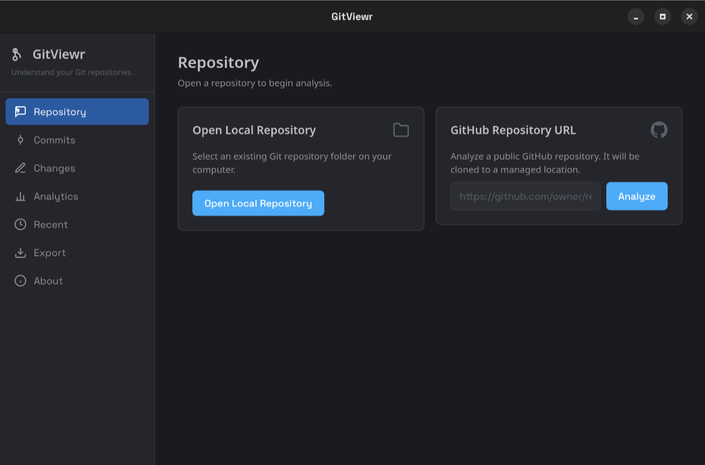
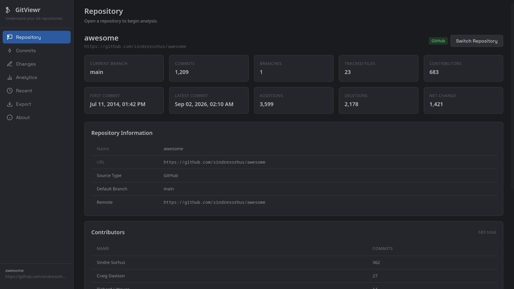
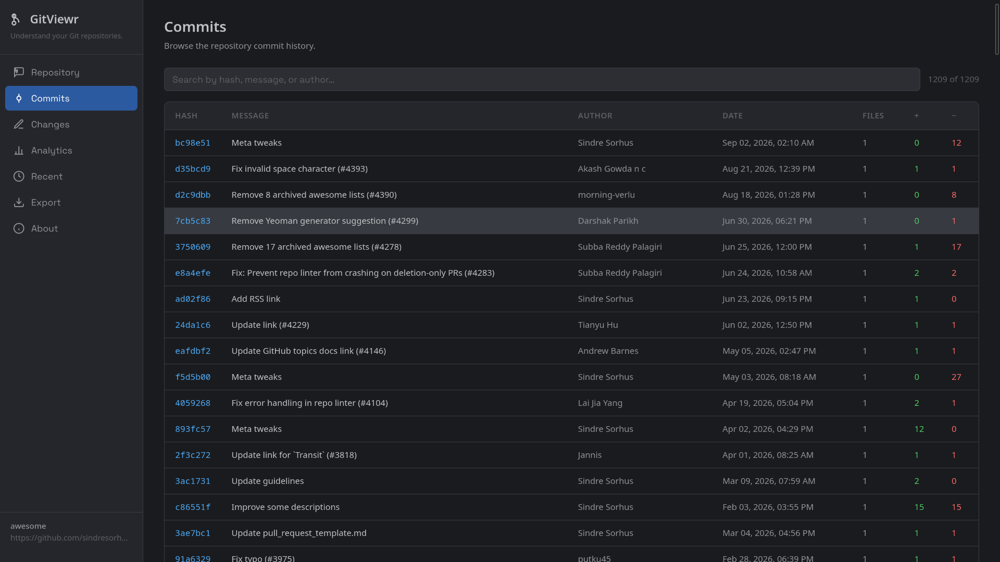
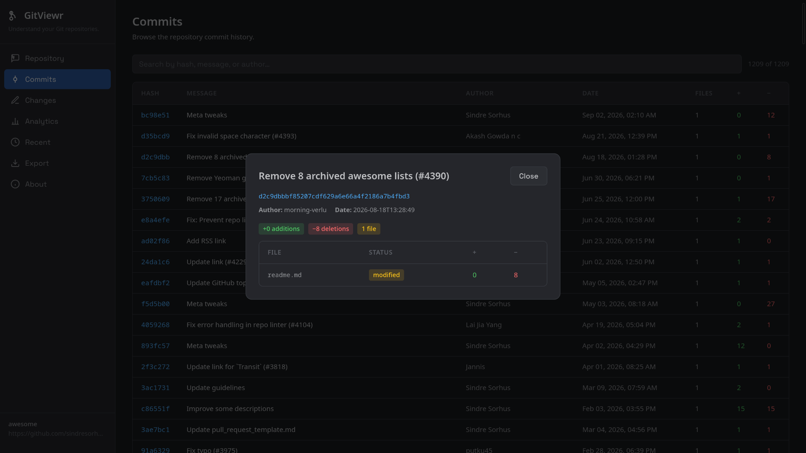
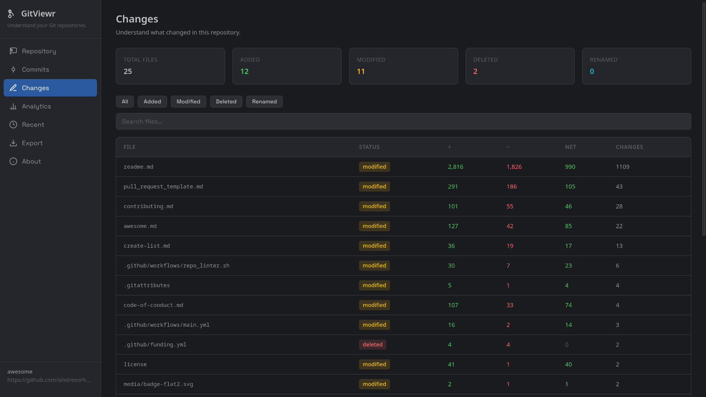
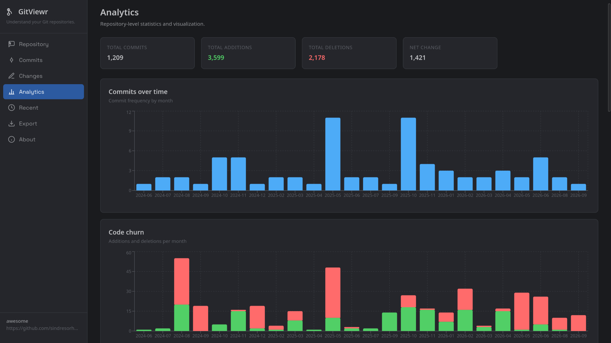

# GitViewr

> Understand your Git repositories.

GitViewr is a desktop application that opens a Git repository, walks its history, and turns it into readable views of commits, changes, contributors, and activity over time. It works with local folders and public GitHub repositories.

It is read-only — GitViewr never writes to the repository you analyze; it only reads it with [libgit2](https://libgit2.org/).

[](https://github.com/pvk-96/gitviewr/actions/workflows/ci.yml)



## Features

- **Local or GitHub** — open any folder containing a `.git` directory, or paste a `https://github.com/owner/repository` URL. GitHub repositories are cloned once into a managed cache and reused on later analyses.
- **Repository overview** — current branch, number of branches and tracked files, contributor count, first and latest commit dates, and total additions/deletions.
- **Commit history** — newest-first list with subject, author, date, and per-file deltas; click any commit for a detail view.
- **File changes** — per-file statistics (status, times changed, additions, deletions, last touched) with search and status filtering.
- **Analytics** — monthly commit activity and line churn, per-contributor contributions, a cumulative code-growth chart, and a file-hotspots table.
- **Recent repositories** — the last three are remembered (deduplicated, most recent first).
- **Export** — save the analysis as HTML, JSON, or PDF.
- **About** — version, developer site, and support link.

## Screenshots

<table>
  <tr>
    <td><br><em>Repository overview</em></td>
    <td><br><em>Commit history</em></td>
  </tr>
  <tr>
    <td><br><em>Commit detail</em></td>
    <td><br><em>File changes</em></td>
  </tr>
  <tr>
    <td colspan="2"><br><em>Analytics</em></td>
  </tr>
</table>

## Installation

**From a release** — grab the latest package for your platform from the [Releases](https://github.com/pvk-96/gitviewr/releases) page. v0.1.0 ships Linux packages (`.deb` and `.rpm`); macOS and Windows builds still need packaging work (see [Roadmap](#roadmap)).

**From source** — see [Development](#development).

## Usage

1. Open **Repository** and pick a local folder, or paste a public GitHub URL.
2. Wait for the analysis — progress is shown while the history is walked.
3. Browse **Repository**, **Commits**, **Changes**, and **Analytics**.
4. Optionally export the result to HTML, JSON, or PDF from the **Export** tab.

## How it works

The backend opens the repository with libgit2 and walks its full commit history from the checked-out branch, generating parent-versus-child diffs with rename detection enabled. From that it builds the per-commit records, repository statistics, contributor totals, monthly time buckets, and per-file churn data you see in the UI.

Merge commits are diffed against their first parent, so a merge's changes reflect what it brought in rather than a three-way comparison. The JSON analysis is parsed directly from the app, which is why export output always matches what is on screen.

## Export

Three formats, all written to a location you choose:

- **HTML** — a styled standalone report with the repository stats, contributors, and commit history.
- **JSON** — the full analysis payload plus generation metadata, handy if you want to process it yourself.
- **PDF** — a plain-text A4 report. The PDF writer is intentionally minimal (a built-in generator using base-14 Helvetica fonts): tables are simple and line-based, Latin-1 only, and any non-Latin characters render as `?`.

## Limitations

- Analysis covers the **default / checked-out branch**; there is no branch or commit-range selection yet.
- GitHub support is for **public repositories only**, and the first analysis needs an internet connection to clone.
- PDF export is minimal (see above).
- Merge commits include the aggregate diff against the first parent.
- Large repositories take longer to analyze; progress is streamed during the history walk.

## Tech stack

- [Tauri 2](https://tauri.app)
- Rust
- React
- JavaScript
- [Vite](https://vite.dev)
- libgit2 (via the [`git2`](https://crates.io/crates/git2) crate)

No system `git` binary is needed at runtime.

## Development

Prerequisites:

- [Rust](https://www.rust-lang.org/tools/install) — a recent stable toolchain; CI builds with 1.98.
- [Node.js](https://nodejs.org) 20+ and npm.
- [Tauri prerequisites](https://tauri.app/start/prerequisites/) for your platform (on Linux: `libwebkit2gtk-4.1-dev`, `libgtk-3-dev`, and OpenSSL development files for libgit2).

```bash
npm install

# run the app in development
npm run tauri dev

# frontend unit tests (Vitest)
npm test

# Rust unit + integration tests
cd src-tauri && cargo test

# build release bundles
npm run tauri build
```

The frontend tests use Vitest; the Rust tests create throwaway git repositories with real libgit2, so no network or existing repos are needed for `cargo test`. One integration test (`github_e2e`) is gated behind `GITVIEWR_NETWORK_TESTS=1`.

## Architecture

```
React            UI, per-tab pages, local state only
  ↓  Tauri IPC (commands)
Rust             thin command handlers → services
  ↓
libgit2          history walk, diffs, metadata      storage → recent.json, clone cache
  ↓
AnalysisData     typed JSON models
  ↓
React UI          or  exporters (HTML / JSON / PDF)
```

The layout is deliberately simple: `src/` holds the React frontend, `src-tauri/src/` the Rust backend split into `commands/` (IPC handlers), `git/` (libgit2 access), `services/` (analysis and exporters), `models/` (shared data types), and `storage/` (the recent-repositories store). Clone cache lives under the app-data directory, so repositories are never cloned into random locations.

## Roadmap

- Branch and commit-range selection.
- Windows packaging.
- Cleanup items only visible to the developer (PDF writer internals, report templating).

If you want something else, open an issue on GitHub.

## About

GitViewr is developed by [Praneeth Varma K](https://pvk96.in). If you find it useful, you can [buy me a coffee](https://www.buymeacoffee.com/pvk96).

- Website: <https://pvk96.in>
- GitHub: <https://github.com/pvk-96/gitviewr>